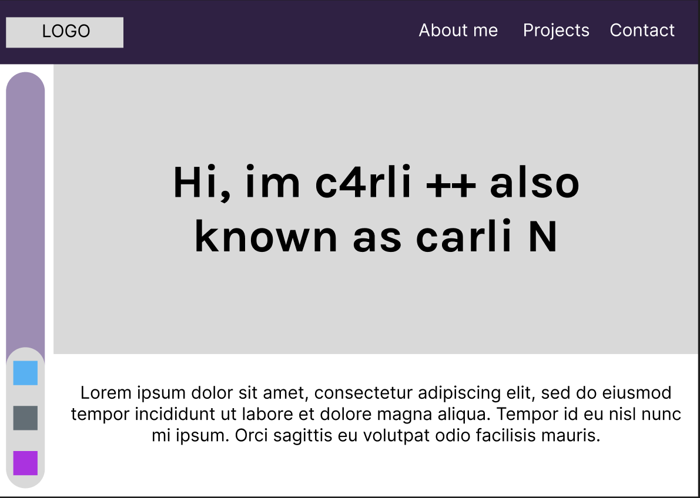
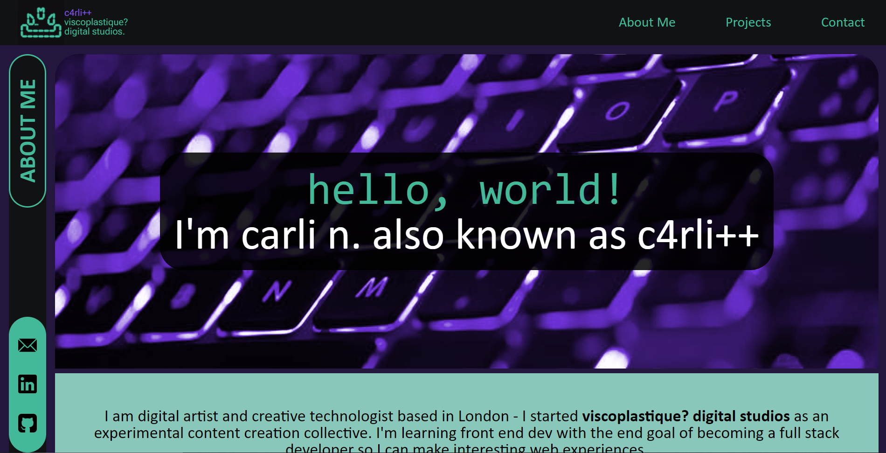

# Bootcamp-Challenge-2-Dev-Portfolio
Portfolio for Web Development as part of a Front End Dev Bootcamp challenge.

## Description
This repo contains source code for my personal development portfolio.

Bootcamp Challenge 2 is to build a portfolio featuring my projects, from scratch using tools that we have learnt in the past 2 weeks including flexbox and css grids. 

### My User Story:
```
I want a page that will showcase my projects, It will have 3 sections. One for an "about me", one for "projects" and one with "contact". 
The page will be styled as to demonstrate coding flair and reflect my personality.
```

### Features:
- Features use of `flex` and `grids`
- Responsive design using `media queries`
- Suitable for Large Laptop, Tablet and Mobile phone. 
- Reworked CSS for mobile view.

### Wireframe:

### Preview of webpage:


## Installation
N/A

## Usage
Deployed webpage can be found here:  [c4rli's Dev Portfolio - Homepage](https://c4rli.github.io/Bootcamp-Challenge-2-Dev-Portfolio/)

## Credits
Source code written by carli n.

## License
Please refer to the LICENSE in the repo.